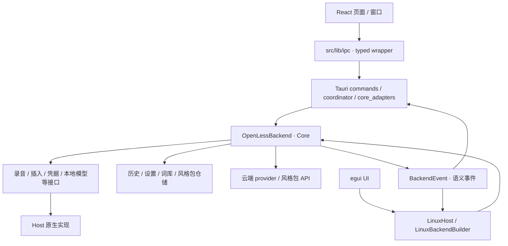

# OpenLess 2.0 架构

状态：canonical，当前实现说明；更新：2026-09-08。平台范围见 [2.0 需求](2.0-requirements.md)，文件定位见 [目录结构](structure.md)。

## 1. 分层与工作区

应用开发与构建源在 `openless-all/app/`。下文源码路径以该目录为基准。根 [Cargo workspace](../openless-all/app/Cargo.toml) 成员为 `crates/openless-core` + `linux-egui`；`src-tauri`（及其 `backend-tests` 测试 crate）被 exclude，独立构建。Core 是与 Host 同进程的业务库。

| 层 | 位置 | 职责 |
| --- | --- | --- |
| 界面（Win/mac/Android） | `src/`（React/TypeScript/i18next，八种界面语言） | 页面、设置、窗口分支；调用 typed IPC，展示快照与事件 |
| Host（Win/mac/Android） | `src-tauri/`（crate `openless`） | `src/lib.rs` 注册命令；适配窗口、热键、音频、凭据、插入、IME 和生命周期 |
| 共享 Core | `crates/openless-core/` | 业务规则、会话、服务调用和数据仓储；通过 trait 接入 Host 能力 |
| Linux Host + UI | `linux-egui/`（crate `openless-linux-egui`） | `backend.rs` 组装 `OpenLessBackend`，`main.rs` 实现 egui/eframe UI，不依赖 Tauri/WebKitGTK |

Android 侧：`src-tauri/src/android/`（JNI/桥接）+ `android/`（aidl、kotlin、manifests、frontend）；`android/frontend` 经 Vite 别名 `@android` 被 `src/` 引用；manifest 由 `scripts/merge-android-*.mjs` 合成。Linux 已有可复用 Host/UI 起点，剩余能力与产品验收见 [交接目录](linux-egui-handoff/README.md)。

## 2. 数据流

- 桌面：React → 类型化 IPC 门面（`src/lib/ipc/`）→ Tauri command → Core；Core 事件由 Host 转发回界面。
- Linux：egui UI → `LinuxHost`（`lib.rs`：`snapshot` / `subscribe` / `save_settings` / `drain_events` 等）→ `OpenLessBackend` → Core，类型化 Rust 接口，不经 IPC。
- 浏览器预览：provider 公开目录由 Core 生成到 `src/lib/ipc/provider-descriptors.generated.json`（`cargo run --locked -p openless-core --example export_provider_descriptors` 重新生成；只含公开元数据，无凭据）；原生端走同一受启动合同保护的 IPC。
- 语言目录：`contract/language-catalog.json` 是工作语言原生名、识别代码与 Apple locale 的单一来源；React `languageCatalog.ts` 和 Core `language_catalog.rs` 读取同一份数据，识别服务仍在运行时判断具体语种是否可用。界面语言独立保存在 `ol.locale`，启动和切换经既有 `set_remote_locale` 将解析后的语言同步给原生托盘与手机远程输入页。
- 旧 React command/event 名称只保留在 Tauri 兼容 Adapter；跨平台合同以 `contract/backend-2.0.json` 为准。

启动时，`src/App.tsx` 经 `src/lib/ipc/shared.ts` 请求 `get_startup_snapshot`，校验合同版本和 backend 运行状态后进入业务界面。Core 事件定义在 `events.rs`，Tauri 的转译入口为 `src-tauri/src/tauri_events.rs`，Linux 直接订阅类型化事件。

听写主链由 `dictation_engine.rs` 管理：触发会话 → 录音/ASR → 清理与润色 → Host 插入 → 历史与事件。Tauri 在 `coordinator/dictation_core.rs` 接入该链路；本地 ASR 的模型管理归 Core，原生执行实现分别位于 Host。取消、失败和旧会话事件处理也属于该业务链，而不是页面各自实现。

## 3. Core 模块地图（按域，见 `src/lib.rs` pub mod 清单）

- 听写链路：`dictation_engine` / `dictation_context` / `audio` / `external_audio` / `silence_auto_stop` / `streaming_insert` / `hotkey_interpreter` / `voice_session`
- 服务与凭据：`provider_rules` / `provider_registry` / `provider_resolution` / `provider_service` / `provider_transport` / `cloud_providers` / `providers` / `omni` / `llm_gemini` / `credentials`(+`credentials_legacy`) / `endpoint_security` / `net`
- 本地模型：`model_store` / `local_asr_service` / `local_asr_catalog` / `asr/`（云与本地 provider 实现）
- 文本加工：`polish` / `prompt_compose`(+`prompts/`，`include_str!` 编译进二进制) / `output_cleaning` / `correction` / `vocabulary`
- 知识与历史：`history` / `activity` / `style_packs` / `style_pack_store`(+`style_pack_archive`) / `marketplace`
- 交互域：`qa_service` / `selection_service` / `selection_voice_service`(+`selection_voice_intent`) / `edit_plan` / `less_computer` / `coding_agent`(+`coding_agent_guard`) / `remote_input_service` / `auxiliary` / `cli`
- 基座：`api` / `events` / `ports` / `settings` / `preferences` / `persistence` / `config` / `errors` / `types` / `shared_types` / `shortcut_types` / `domains` / `android_types` / `host_document/` / `testing` / `vendor/`

## 4. Host 注入点

操作系统集成由 Host 提供。Core 的 `ports.rs`、`config.rs`、`domains.rs` 和 `credentials.rs` 定义录音、插入、任务执行、系统动作、领域运行时及凭据接口；Core 自身仍包含 HTTP 调用和框架无关的文件仓储。

Tauri 在 `src-tauri/src/coordinator.rs` 构造 Core，`core_adapters.rs` 组装原生依赖并对接已有 persistence。Linux 在 `linux-egui/src/backend.rs` 使用 `LinuxBackendBuilder`，注入音频、凭据、服务、设置、本地 ASR 和平台动作。`BackendConfig` 由 Host 提供数据、缓存、资源路径与平台能力。

业务规则缺失时应修复 Core；平台能力缺失时修复对应 Host。设置值、测试 fixture 或 `Unsupported` 实现不能代表原生能力已就绪。

## 5. 窗口体系

`src-tauri/tauri.conf.json` 声明 `main`、`capsule` 两个窗口。`src/main.tsx` 读取 `?window=`，`src/App.tsx` 按类型加载胶囊、`qa`、`selection-polish-preview`、`selection-voice-intent`、`less-computer` 和 `less-computer-glow`；未指定类型时进入主界面。各 WebView 共用前端入口，重页面按需加载；移动端再依据平台能力选择布局。Linux 单实例由 `linux-egui/src/single_instance.rs` 守护并转发启动意图。

主窗口默认逻辑尺寸为 1300×835，允许用户调整；macOS 原生窗口按钮左侧和顶部均留出 16px，前端保留 44px 拖动区。桌面侧栏宽 226px，主内容从版本行下方开始，设置面板单独限制高度并在内部滚动。

Siri、Classic、Typeless 三种胶囊共用 Core 的 `CapsuleStyle`，窗口尺寸与点击范围在保存偏好时同步。胶囊按显示器工作区底部定位，避开未自动隐藏的 Dock/任务栏；可见期间重新检查工作区。带正文的浮窗使用不透明底色，聊天面板另叠加细噪点纹理，圆角外部仍保留透明区域。

界面启动等待所选语言资源就绪；语言选择持久化到 `ol.locale`，其他 WebView 通过存储事件同步，日期、数字和默认风格展示随语言变化。用户修改的风格名称、说明和内容保持原文。旧版两种强制排版字段只保留数据兼容，界面清除其布局效果，窄屏改由响应式布局处理。

## 6. 存储与外部服务

| 数据或连接 | 所有者与源码入口 |
| --- | --- |
| 历史、活动、偏好、词库、纠错、风格包 | Core 对应仓储模块；Tauri `src-tauri/src/persistence/` 提供平台路径及兼容存储适配 |
| 模型与录音文件 | Core `model_store.rs`、Host 本地运行时和 `persistence/paths.rs`；录音归档受设置控制 |
| 服务凭据 | Core `CredentialStore` 合同，Tauri keyring/Android Keystore 或 Linux `credentials.rs` 适配 |
| 云端 ASR / LLM | Core provider 目录、选择与传输模块；平台本地引擎位于 `src-tauri/src/asr/local/` 或 Linux Host |
| 风格包市场 | Core `marketplace.rs` 管理 HTTP、GitHub device flow 与本地安装；地址由 `MarketplaceConfig` 注入，内置默认值在该模块 |
| 私有云同步 | Core `cloud_sync.rs` 复用同一 GitHub 登录与官方服务地址，按版本同步词典、纠错、风格包和允许的个人偏好；`cloud_sync_transaction.rs` 在本地恢复失败时回滚文件，凭据和设备配置保持本机所有。合同及边界见 [官方云同步](cloud-sync.md) |
| 风格图标 | React `src/lib/stylePackIcon.ts` 清理上传的 SVG 并转成 PNG；`set_style_pack_icon` / `read_style_pack_icon` 经 Core `style_pack_store.rs` 保存资源、校验读取范围并返回图片 data URL。图标沿用 ZIP 的 64 KiB 限制，与风格包一起导出 |
| 局域网手机输入 | Core `remote_input_service.rs` 定义共享业务，Tauri `remote_server/` 提供本机网络入口和网页资源 |

应用不会把普通听写交给风格包市场后端。市场安装完成后使用本地风格包；官网也不参与应用的业务调用。长期参考数据、训练准备和历史快照不是 Core 的在线训练服务。

macOS 凭据在 `persistence/credentials.rs` 使用单个 `credentials.v2` 钥匙串项目；首次迁移读取旧分块一次并保留旧项目供旧版本使用。读取失败返回错误，不能降级成“未配置”；ASR 配置状态从同一次成功读取的快照生成。其他平台保留各自存储限制与适配。

## 7. 验证入口

以下命令均在 `openless-all/app/` 执行，按变更范围选择：

| 范围 | 命令与依据 |
| --- | --- |
| 前端与合同 | `npm test`；`pretest` 先构建，`scripts/frontend-test-runner.mjs` 发现前端测试和脚本合同检查，含 Core 快捷键回归 |
| Core/Linux 格式 | `cargo fmt --all --check`，仅根 workspace |
| Core | `cargo test -p openless-core --locked` |
| Linux Host | `cargo test -p openless-linux-egui --locked`；原生能力在 Linux 目标环境验证 |
| Tauri 格式与编译 | `cargo fmt --manifest-path src-tauri/Cargo.toml --check`、`cargo check --locked --manifest-path src-tauri/Cargo.toml` |
| Tauri 库与独立回归 crate | 依平台选 `cargo test --locked --manifest-path src-tauri/Cargo.toml --lib`、`cargo test --locked --manifest-path src-tauri/backend-tests/Cargo.toml`；适用矩阵见 [CI](../.github/workflows/ci.yml) |

源码构建 Tauri 前执行 `git submodule update --init --recursive`。其 manifest 含受 target 条件控制的本地 path 依赖，Cargo 解析仍需对应子模块；部分 CI 作业通过专用脚本去除非目标依赖。Core/Linux workspace 排除 Tauri，不需要为这些独立检查初始化 Tauri 子模块。

仅 Markdown 变动检查相对链接、源码路径与描述一致性。平台交付按 [桌面验收](2.0-desktop-acceptance.md)、[Linux 验收](linux-egui-handoff/07-acceptance.md)和 [发布规范](../RELEASING.md)完成。
