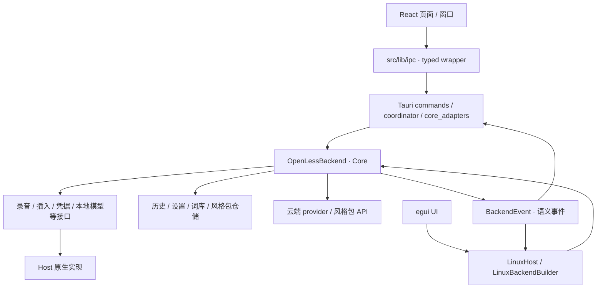

# OpenLess 2.0 架构

状态：canonical，当前实现说明；更新：2026-09-30。平台范围见 [2.0 需求](2.0-requirements.md)，文件定位见 [目录结构](structure.md)。

## 1. 分层与工作区

应用开发与构建源在 `openless-all/app/`。下文源码路径以该目录为基准。根 [Cargo workspace](../openless-all/app/Cargo.toml) 成员为 `crates/openless-core` + `linux-egui`；`src-tauri`（及其 `backend-tests` 测试 crate）被 exclude，独立构建。Core 是与 Host 同进程的业务库。

| 层 | 位置 | 职责 |
| --- | --- | --- |
| 界面（Win/mac/Android） | `src/`（React/TypeScript/i18next，八种界面语言） | 页面、设置、窗口分支；调用 typed IPC，展示快照与事件 |
| Host（Win/mac/Android） | `src-tauri/`（crate `openless`） | `src/lib.rs` 注册命令；适配窗口、热键、音频、凭据、插入、IME 和生命周期 |
| 共享 Core | `crates/openless-core/` | 业务规则、会话、服务调用和数据仓储；通过 trait 接入 Host 能力 |
| Linux Host + UI | `linux-egui/`（crate `openless-linux-egui`） | `backend.rs` 组装 `OpenLessBackend`，`main.rs` 实现 egui/eframe UI，不依赖 Tauri/WebKitGTK |

Android 侧：`src-tauri/src/android/`（JNI/桥接）+ `android/`（aidl、kotlin、manifests、frontend）；`android/frontend` 经 Vite 别名 `@android` 被 `src/` 引用；manifest 由 `scripts/merge-android-*.mjs` 合成。Linux 已有可复用 Host/UI 起点，剩余能力与产品验收见 [交接目录](linux-egui-handoff/README.md)。

## 2. 数据流

```mermaid
flowchart TB
    React["React 页面 / 窗口"] --> IPC["src/lib/ipc · typed wrapper"]
    IPC --> Tauri["Tauri commands / coordinator / core_adapters"]
    Egui["egui UI"] --> Linux["LinuxHost / LinuxBackendBuilder"]
    Tauri --> Core["OpenLessBackend · Core"]
    Linux --> Core
    Core --> Stores["历史 / 设置 / 词库 / 风格包仓储"]
    Core --> Network["云端 provider / 风格包 API"]
    Core --> Ports["录音 / 插入 / 凭据 / 本地模型等接口"]
    Ports --> Native["Host 原生实现"]
    Core --> Events["BackendEvent · 语义事件"]
    Events --> Tauri
    Events --> Linux
```

- 桌面：React → 类型化 IPC 门面（`src/lib/ipc/`）→ Tauri command → Core；Core 事件由 Host 转发回界面。
- Linux：egui UI → `LinuxHost`（`lib.rs`：`snapshot` / `subscribe` / `save_settings` / `drain_events` 等）→ `OpenLessBackend` → Core，类型化 Rust 接口，不经 IPC。
- 浏览器预览：provider 公开目录由 Core 生成到 `src/lib/ipc/provider-descriptors.generated.json`（`cargo run --locked -p openless-core --example export_provider_descriptors` 重新生成；只含公开元数据，无凭据）；原生端走同一受启动合同保护的 IPC。
- 语言目录：`contract/language-catalog.json` 是工作语言原生名、识别代码与 Apple locale 的单一来源；React `languageCatalog.ts` 和 Core `language_catalog.rs` 读取同一份数据，识别服务仍在运行时判断具体语种是否可用。界面语言独立保存在 `ol.locale`，启动和切换经既有 `set_remote_locale` 将解析后的语言同步给原生托盘与手机远程输入页。
- 旧 React command/event 名称只保留在 Tauri 兼容 Adapter；跨平台合同以 `contract/backend-2.0.json` 为准。

启动时，`src/App.tsx` 经 `src/lib/ipc/shared.ts` 请求 `get_startup_snapshot`，校验合同版本和 backend 运行状态后进入业务界面。Core 事件定义在 `events.rs`，Tauri 的转译入口为 `src-tauri/src/tauri_events.rs`，Linux 直接订阅类型化事件。

听写主链由 `dictation_engine.rs` 管理：触发会话 → 录音/ASR → 清理与润色 → Host 插入 → 历史与事件。Tauri 在 `coordinator/dictation_core.rs` 接入该链路；本地 ASR 的模型管理归 Core，原生执行实现分别位于 Host。取消、失败和旧会话事件处理也属于该业务链，而不是页面各自实现。

Android 悬浮窗在录音中转入追问时，Host 先捕获原选区，Core 的 `stop_dictation_for_qa` 按原会话 ID 完成转写并释放听写资源，跳过听写润色与文字插入，再由 `QaApi::submit_captured_text` 接收已录问题和选区。重复手势由 Host 的异步锁合并；QA 不重新抓取已经变化的前台选区。

Android IME 通过 `InputConnection` 插入文字；笔画、英文候选与轻量拼音由原生 Kotlin 控制器处理。`OpenLessApplication`、`OpenLessRuntimeService` 和 Warmup Activity 管理后台运行与恢复。用户操作与验收入口见 [Android 输入法](android-ime.md)。

设置保存使用 `get_settings_snapshot` / `update_setting_fields`：前端只提交字段差异，Core 按偏好修订号提交事务并在版本冲突时重试；`prefs:changed` 使前端重新读取快照。`preferencesWriteGate.ts` 将尚未完成的本地编辑叠加到已确认快照，失败时只撤回对应请求。

手改学词由 Core 的 `host_document/observation.rs` 和 `api.rs` 管理插入范围、观察代数、建议有效期与词典写入。独立本机授权默认关闭，配置位于「实验与扩展 → 手改学词」；观察时长 10–60 秒、建议有效期 5–60 秒、最大自动词长 2–32 个字符。设置改变会结束旧观察并清除旧建议，授权与参数不进入云同步。macOS AX、Windows UIA 与 Android 无障碍仅在当前编辑器内进行短时观察，密码框和已知敏感应用被排除；观察文本仅用于本地差分，确认前不写入词典。`PendingCorrection.expiresAtMs` 是 Web 和 Android 确认卡共用的截止时间；历史详情与 Android IME 保留显式确认加词入口，Linux 原生观察仍在独立验收范围。

## 3. Core 模块地图（按域，见 `src/lib.rs` pub mod 清单）

- 听写链路：`dictation_engine` / `dictation_context` / `audio` / `external_audio` / `silence_auto_stop` / `streaming_insert` / `hotkey_interpreter` / `voice_session`
- 服务与凭据：`provider_rules` / `provider_registry` / `provider_resolution` / `provider_service` / `provider_transport` / `cloud_providers` / `providers` / `omni` / `llm_gemini` / `credentials`(+`credentials_legacy`) / `endpoint_security` / `net`
- 本地模型：`model_store` / `local_asr_service` / `local_asr_catalog` / `asr/`（云与本地 provider 实现）
- 文本加工：`polish` / `prompt_compose`(+`prompts/`，`include_str!` 编译进二进制) / `output_cleaning` / `correction` / `vocabulary`
- 知识与历史：`history` / `activity` / `style_packs` / `style_pack_store`(+`style_pack_archive`) / `marketplace`
- 交互域：`qa_service` / `selection_service` / `selection_voice_service`(+`selection_voice_intent`) / `edit_plan` / `less_computer` / `coding_agent`(+`coding_agent_guard`) / `remote_input_service` / `auxiliary` / `cli`
- 基座：`api` / `events` / `ports` / `settings` / `preferences` / `persistence` / `config` / `errors` / `types` / `shared_types` / `shortcut_types` / `domains` / `android_types` / `host_document/` / `testing` / `vendor/`

## 4. Host 注入点

操作系统集成由 Host 提供。Core 的 `ports.rs`、`config.rs`、`domains.rs` 和 `credentials.rs` 定义录音、插入、任务执行、系统动作、领域运行时及凭据接口；Core 自身仍包含 HTTP 调用和框架无关的文件仓储。

Tauri 在 `src-tauri/src/coordinator.rs` 构造 Core，`core_adapters.rs` 组装原生依赖并对接已有 persistence。Linux 在 `linux-egui/src/backend.rs` 使用 `LinuxBackendBuilder`，注入音频、凭据、服务、设置、本地 ASR 和平台动作。`BackendConfig` 由 Host 提供数据、缓存、资源路径与平台能力。

业务规则缺失时应修复 Core；平台能力缺失时修复对应 Host。设置值、测试 fixture 或 `Unsupported` 实现不能代表原生能力已就绪。

## 5. 窗口体系

`src-tauri/tauri.conf.json` 声明 `main`、`capsule` 两个窗口。`src/main.tsx` 读取 `?window=`，`src/App.tsx` 按类型加载胶囊、`qa`（含复用它的「润色结果」模式）、`selection-voice-intent`、`less-computer` 和 `less-computer-glow`；未指定类型时进入主界面。各 WebView 共用前端入口，重页面按需加载；移动端再依据平台能力选择布局。Linux 单实例由 `linux-egui/src/single_instance.rs` 守护并转发启动意图。

主窗口默认逻辑尺寸为 1300×835，允许用户调整；macOS 原生窗口按钮左侧和顶部均留出 16px，前端保留 44px 拖动区。桌面侧栏宽 226px，主内容从版本行下方开始，设置面板单独限制高度并在内部滚动。

Siri、Classic、Typeless 三种胶囊共用 Core 的 `CapsuleStyle`，窗口尺寸与点击范围在保存偏好时同步。胶囊按显示器工作区底部定位，避开未自动隐藏的 Dock/任务栏；可见期间重新检查工作区。带正文的浮窗使用不透明底色，聊天面板另叠加细噪点纹理，圆角外部仍保留透明区域。

思考动画覆盖转写、润色和原生文字写入，输入完成后才收尾。macOS 流式键盘输入由会话内串行 worker 维护原控件和累计 UTF-16 终点；每批发送后不再等待 AX 长确认，finish/cancel 在已接收写入之后等待最终屏障，再恢复输入源。AX 仅读选区范围，不读正文；采用 250 ms 无进展预算和 10 秒总预算。不可读、提交型 Return 或预算耗尽时明确降级到按键已发送语义，不重新粘贴已发送文字。目标应用的实际输入表现仍需设备验收。

Less Computer 面板将听写与直接语音提交分开：麦克风把转写填入草稿供编辑，语音模式和快捷键可直接提交给 Agent。Core 的 `voice_state` 事件携带会话 ID、模式、实时转写及收尾结果；波形使用实际音量采样。停止和取消均绑定指定会话，延迟请求不能结束下一段录音；开麦与文字发送互斥。工具过程默认折叠，运行状态只在真实活动步骤显示动效，右侧工作台汇总当前轮次；历史和多会话仍标为暂不可用。登录弹窗打开时，听写结果只更新草稿，不抢走弹窗或授权浏览器的焦点。

选区直接润色在捕获文字和原输入目标后显示处理中提示，重复快捷键的 Busy 返回不覆盖该提示。已有语音选区入口在松开快捷键后继续显示思考动画，直到处理/替换完成，或交给确认和预览面板。录音提示音的 Web Audio context 在恢复超时或音频时钟冻结时丢弃并最多重试一次，重试沿用原请求的取消和迟到边界。

Selection Voice 在有效输入目标中允许空选区：Core 将无草稿编辑转换为 Compose，生成正文后沿用预览/直接插入路径；已有选区仍按编辑或问答处理。Host 的胶囊所有权与会话 ID 绑定，结束录音后停止接收音量帧，终态通过 Done/Idle 收尾。Selection Voice 和 Less Computer 的辅助录音遵循当前多模态偏好；Omni 将音频转换为指令文字，后续意图、编辑与 Agent 调用仍由各自模型完成。

AI 服务设置在顶部选择传统或多模态模式，各配置入口等宽排布并完整显示，不依赖横向滑动。传统模式禁用多模态模型入口；多模态模式禁用语言模型、语音识别和本地模型入口。禁用入口名称置灰，名称下方附醒目的黄/琥珀色“当前模式未使用”提示，鼠标和键盘均不可进入；连接与扩展保持可用。多模态表单将供应商/模型及自定义高级字段并排，拉取模型与验证集中在页尾；桌面常用窗口内单页显示完整表单，窄屏或放大字体时保留内容的可访问性。切换模式时若当前页面已禁用，则转到当前模式可用的配置页；本地模型的内部跳转入口受相同限制。切换模式保留两组渠道和凭据。Omni 连接测试只验证文本请求，实际音频可用性需录音验证；DashScope 音频使用 `data:;base64,` 和独立 `format` 字段。API Route 作为可手动添加的 OpenAI 兼容润色渠道，不改变默认提供方。

界面动效由 `src/lib/motion.ts` 统一管理：设置面板以 360ms 淡入、上移并缩放到位，背景以 220ms 淡入；先绘制入场起点，再启动动画时钟。其他弹窗入场和配置内容切换 240ms、弹窗退出 180ms，主页面进入 160ms、退出 90ms；缓动读取 `tokens.css` 中的入场/退出曲线，设置入场使用 soft 曲线。动画使用透明度、位移及缩放，不动画布局尺寸。快速关闭、重开或切回原页从当前绘制状态续播，旧切页任务不能覆盖新选择。`useExitMount` 共用退出时长；系统开启减少动态效果时跳过动画等待。服务设置的模式高亮和分类指示条在选中项间移动，供应商配置切换淡入；加载图标与保存中状态保持真实反馈，临时合成层在完成或取消后释放。

界面启动等待所选语言资源就绪；语言选择持久化到 `ol.locale`，其他 WebView 通过存储事件同步，日期、数字和默认风格展示随语言变化。用户修改的风格名称、说明和内容保持原文。旧版两种强制排版字段只保留数据兼容，界面清除其布局效果，窄屏改由响应式布局处理。

## 6. 存储与外部服务

| 数据或连接 | 所有者与源码入口 |
| --- | --- |
| 历史、活动、偏好、词库、纠错、风格包 | Core 对应仓储模块；Tauri `src-tauri/src/persistence/` 提供平台路径及兼容存储适配 |
| 模型与录音文件 | Core `model_store.rs`、Host 本地运行时和 `persistence/paths.rs`；录音归档受设置控制 |
| 服务凭据 | Core `CredentialStore` 合同，Tauri keyring/Android Keystore 或 Linux `credentials.rs` 适配 |
| 云端 ASR / LLM | Core provider 目录、选择与传输模块；平台本地引擎位于 `src-tauri/src/asr/local/` 或 Linux Host |
| 风格包市场 | Core `marketplace.rs` 管理 HTTP、GitHub device flow 与本地安装；地址由 `MarketplaceConfig` 注入，内置默认值在该模块 |
| 加密云同步 | Core `cloud_sync_e2ee` 复用 GitHub 登录并交换独立同步会话，通过 `/v1/...` 保存客户端加密快照；protocol/documents/store 分别负责加密协议、登记与合并、仓库及系统凭据的受控恢复。默认关闭，凭据、本地基线和回滚日志不交给 UI。详情与验证边界见 [加密云同步客户端](encrypted-cloud-sync.md) |
| 旧手动同步 | `cloud_sync.rs` 和 `/me/sync` 保留有限明文快照合同；旧入口不上传新加密文档中的服务密钥。已注册加密恢复 gate 的仓库拒绝旧多文件恢复，防止绕过受控恢复；未注册的旧 Host 保留原合同。见 [旧同步合同](cloud-sync.md) |
| 风格图标 | React `src/lib/stylePackIcon.ts` 清理上传的 SVG 并转成 PNG；`set_style_pack_icon` / `read_style_pack_icon` 经 Core `style_pack_store.rs` 保存资源、校验读取范围并返回图片 data URL。图标沿用 ZIP 的 64 KiB 限制，与风格包一起导出 |
| 局域网手机输入 | Core `remote_input_service.rs` 定义共享业务，Tauri `remote_server/` 提供本机网络入口和网页资源 |

应用不会把普通听写交给风格包市场后端。市场安装完成后使用本地风格包；官网也不参与应用的业务调用。

模型远程元数据只在下载详情选择模型时读取，界面按模型与镜像合并请求并缓存五分钟。Sherpa 离线解码通过 `src-tauri/src/asr/local/blocking_decode.rs` 串行运行；超时或取消不会提前释放原生任务持有的模型和许可，任务结束后才允许下一次解码。长期参考数据、训练准备和历史快照不是 Core 的在线训练服务。

macOS 凭据通过 `persistence/credentials/macos_vault.rs` 共用 `credentials.v2` 钥匙串项目与进程内缓存：服务凭据、云同步本地包装密钥和记住的同步密钥在同一次受保护读取中加载。同步密钥位于 `_macosLocalSyncKeys` 本机扩展，Core 的提供方快照、UI IPC 与云端导出均不包含该字段。提供方保存/恢复保留扩展；新增密钥经原生存储读回验证，遗忘以持久化空值阻止旧项复活并删除旧独立项。

第一次迁移仍须分别获得旧独立钥匙串项目的系统授权，不能取消或扩大它们的 ACL；成功读取后把本机密钥合入同一项目，后续启动只读取该项目。旧分块和迁移来源保留供旧版本使用，读失败不缓存为空、不扫描其他旧项目；可重试授权或读取。Keychain 外部修改在下一次进程启动生效。ASR 配置状态从同一次成功读取的快照生成。其他平台保留各自存储限制与适配。系统对独立项目的授权边界见 [Apple ACL 文档](https://developer.apple.com/documentation/security/access-control-lists)。

## 7. 验证入口

以下命令均在 `openless-all/app/` 执行，按变更范围选择：

| 范围 | 命令与依据 |
| --- | --- |
| 前端与合同 | `npm test`；`pretest` 先构建，`scripts/frontend-test-runner.mjs` 发现前端测试和脚本合同检查，含 Core 快捷键回归 |
| Core/Linux 格式 | `cargo fmt --all --check`，仅根 workspace |
| Core | `cargo test -p openless-core --locked` |
| Linux Host | `cargo test -p openless-linux-egui --locked`；原生能力在 Linux 目标环境验证 |
| Tauri 格式与编译 | `cargo fmt --manifest-path src-tauri/Cargo.toml --check`、`cargo check --locked --manifest-path src-tauri/Cargo.toml` |
| Tauri 库与独立回归 crate | 依平台选 `cargo test --locked --manifest-path src-tauri/Cargo.toml --lib`、`cargo test --locked --manifest-path src-tauri/backend-tests/Cargo.toml`；适用矩阵见 [CI](../.github/workflows/ci.yml) |

源码构建 Tauri 前执行 `git submodule update --init --recursive`。其 manifest 含受 target 条件控制的本地 path 依赖，Cargo 解析仍需对应子模块；部分 CI 作业通过专用脚本去除非目标依赖。Core/Linux workspace 排除 Tauri，不需要为这些独立检查初始化 Tauri 子模块。

仅 Markdown 变动检查相对链接、源码路径与描述一致性。平台交付按 [桌面验收](2.0-desktop-acceptance.md)、[Linux 验收](linux-egui-handoff/07-acceptance.md)和 [发布规范](../RELEASING.md)完成。
